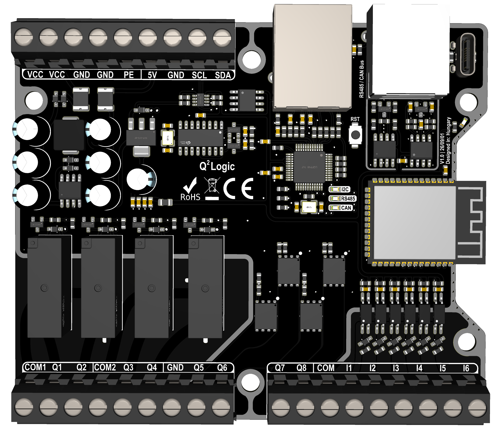
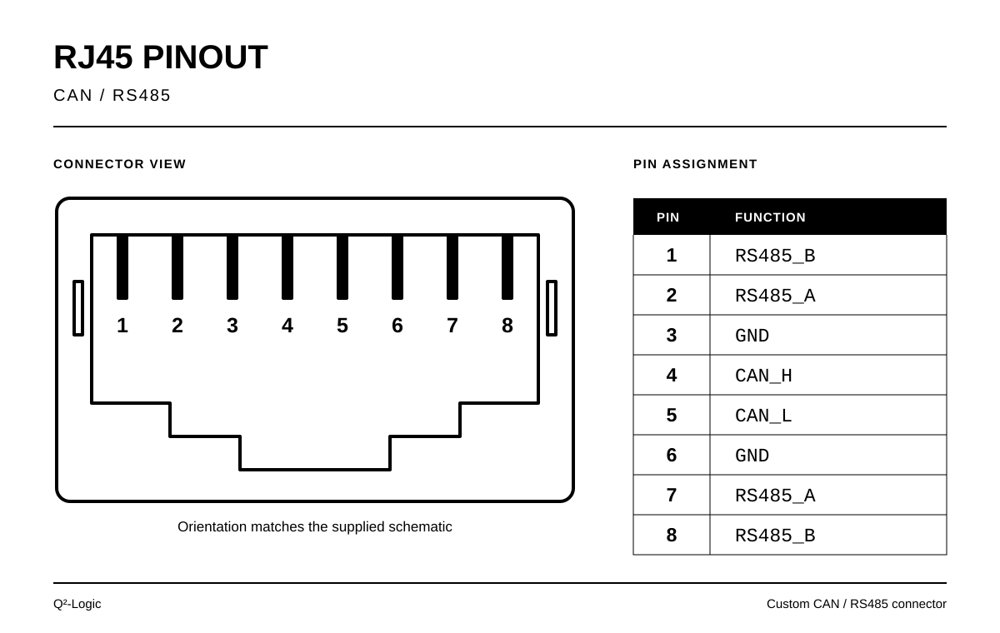
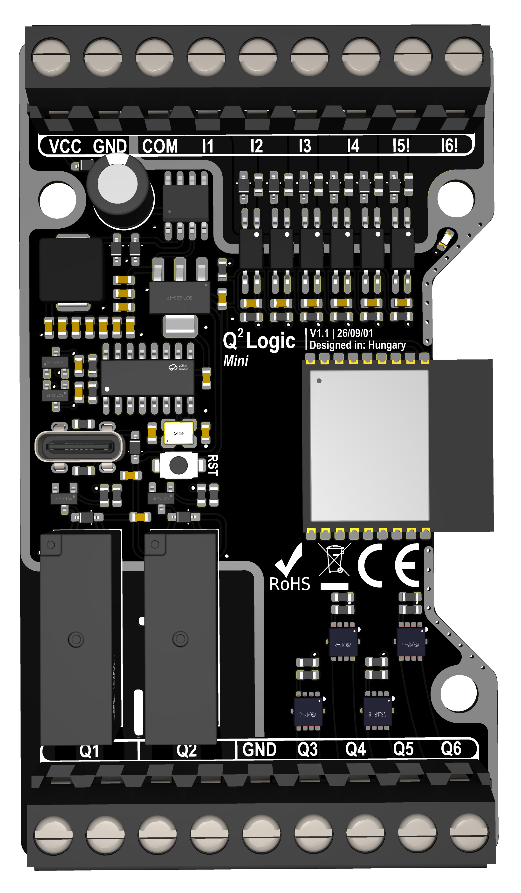

# Q²-Logic
Q²-Logic (Q2-Logic) is a family of ESP32-based programmable controllers developed by Build Electric Kft. This repository provides hardware specifications, Arduino board package installation instructions, and library documentation for Q²-Logic and Q²-Logic Mini.

## Models:
| | <ins>Q²-Logic</ins> | <ins>Q²-Logic Mini</ins> |
| :--- | :---: | :---: |
| **Supply voltage** | *12-24VDC* | *12-24VDC* |
| **Input** | *6* | *6* | 
| **Relay output** | *4* | *2* |
| **MOSFET output** | *4* | *4* |
| **Interface** | *USB-C, Wifi, Ethernet, CAN, RS485, I²C* | *USB-C, Wifi* |
> [!NOTE]
> Relay: *5A/ch | 250VAC*\
> MOSFET: *5A/ch, or max:15A (all chanel) | 30VDC*
>> Maximum temperature at full load: 70 °C

> [!WARNING]
> Do not exceed the maximum rated current, as this may damage the controller!

---

<details>
<summary><strong><ins>Q²-Logic</ins></strong> — Click for a detailed description.</summary>

###
  
<details>
<summary><strong><ins>Board preview</ins></strong> — Click for a PCB</summary>

  
  
</details>

# Q²-Logic

### <ins>General specifications</ins>

- **Microcontroller:** ESP32-S3
- **Board dimensions:** 102 × 86 mm

### <ins>Power supply</ins>

- **Nominal input voltage:** 12–24V DC
- **Minimum input voltage:** 10V DC
- **Absolute maximum input voltage:** 30V DC
- **Reverse-polarity protection**
- **Input current:** 800mA
- **5V output:** maximum current 1A
- **DC/DC converter IC ESD rating:** 2kV HBM (component level)

### <ins>Digital inputs</ins>

- **6 isolated digital inputs**
- **Input voltage between COM and each input:** 10–24V DC

### <ins>Relay outputs</ins>

- **4 relay outputs**
- **Maximum switching current:**
  - 5A at 250V AC
  - 1A at 30V DC

### <ins>MOSFET outputs</ins>

- **4 N-channel MOSFET outputs**
- **Maximum load current:** 5A per channel, with a combined limit of 15A across all four channels
- **Maximum voltage:** 30V DC
- **PWM frequency:** 1.2kHz
- **Maximum temperature at full load:** 70°C

### <ins>Ethernet</ins>

- **Controller:** W5500
- **Link speed:** 10/100Mbps
- **Full- and half-duplex support**
- **Auto-negotiation**

### <ins>CAN bus</ins>

- Multi-master communication: any node can initiate transmission
- Built-in message arbitration and error detection
- Maximum node count depends on the transceivers and network configuration
- On-board 120Ω termination resistor
- Dedicated PESD1CAN TVS protection against ESD and voltage transients

### <ins>RS485</ins>

- Differential communication supporting multiple devices on a shared bus
- Master/slave operation depends on the protocol implemented in firmware
- Maximum node count depends on transceiver loading and protocol limitations
- On-board 120Ω termination resistor
- Dedicated PESD1CAN TVS protection against ESD and voltage transients

> [!NOTE]
> The PESD1CAN protection diodes are rated for 23kV contact discharge under IEC 61000-4-2. This is a component rating, not a verified ESD immunity rating for the complete board.
>
> Bus termination should be fitted at the two physical ends of each bus.

### <ins>I²C</ins>

- **Logic level:** 5V
- **Bus speed:** 100kHz Standard-mode / 400kHz Fast-mode
- **On-board EEPROM:** AT24C08C, 8Kbit (1KB) 7-bit I²C addresses: `0x50`–`0x53`
- **Level translator IC ESD rating:** 5kV HBM (component level)

### <ins>ESP32-S3 IO definition</ins>
| **IO** | **Name** | **Description** | | **IO** | **Name** | **Description** |
| --- | --- | --- | --- |--- | --- | --- |
| GPIO0 | IO0 | Boot / GPIO | | GPIO18 | SEND/REC | RS485 direction |
| GPIO1 | I6_pin | Input 6 | | GPIO19 | SDA | I²C data |
| GPIO2 | I5_pin | Input 5 | | GPIO20 | I2C_OE | I²C translator enable |
| GPIO3 | WRST | W5500 reset | | GPIO21 | Q1_pin | Output 1 |
| GPIO4 | CAN_LED | CAN status LED | | GPIO35 | Q8_pin | Output 8 |
| GPIO5 | RS485_LED | RS485 status LED | | GPIO36 | Q6_pin | Output 6 |
| GPIO6 | I2C_LED | I²C status LED | | GPIO37 | Q5_pin | Output 5 |
| GPIO7 | CAN_RX | CAN receive | | GPIO38 | Q7_pin | Output 7 |
| GPIO8 | SCL | I²C clock | | GPIO39 | I1_pin | Input 1 |
| GPIO9 | SCLK | W5500 SPI clock | | GPIO40 | I2_pin | Input 2 |
| GPIO10 | MOSI | W5500 SPI data out | | GPIO41 | I3_pin | Input 3 |
| GPIO11 | SCSN | W5500 chip select | | GPIO42 | I4_pin | Input 4 |
| GPIO12 | — | Not connected | | GPIO43 | TX | UART0 transmit |
| GPIO13 | — | Not connected | | GPIO44 | RX | UART0 receive |
| GPIO14 | — | Not connected | | GPIO45 | Q4_pin | Output 4 |
| GPIO15 | CAN_TX | CAN transmit | | GPIO46 | MISO | W5500 SPI data in |
| GPIO16 | RS485_TX | RS485 transmit | | GPIO47 | Q2_pin | Output 2 |
| GPIO17 | RS485_RX | RS485 receive | | GPIO48 | Q3_pin | Output 3 |

### <ins>RJ45 - CAN/RS485 pinout</ins>
<details>
<summary><strong><ins>RJ45 - CAN/RS485 pinout</ins></strong> — Click</summary>


  
</details>

| **Pin** | **Signal** | | **Pin** | **Signal** |
| :---: | --- | --- | :---: | --- |
| 1 | RS485_B | | 5 | CAN_L |
| 2 | RS485_A | | 6 | GND |
| 3 | GND | | 7 | RS485_A |
| 4 | CAN_H | | 8 | RS485_B |

</details>

---

<details>
<summary><strong><ins>Q²-Logic Mini</ins></strong>- Click for a detailed description.</summary>

###
  
<details>
<summary><strong><ins>Board preview</ins></strong> — Click for a PCB</summary>

  
  
</details>

# Q²-Logic Mini

### <ins>General specifications</ins>

- **Microcontroller:** ESP32-C3
- **Board dimensions:** 50 × 86 mm

### <ins>Power supply</ins>

- **Nominal input voltage:** 12–24V DC
- **Minimum input voltage:** 10V DC
- **Absolute maximum input voltage:** 30V DC
- **Reverse-polarity protection**
- **Input current:** 800mA
- **DC/DC converter IC ESD rating:** 2kV HBM (component level)

### <ins>Digital inputs</ins>

- **6 isolated digital inputs**
- **Input voltage between COM and each input:** 10–24V DC

### <ins>Relay outputs</ins>

- **2 relay outputs**
- **Maximum switching current:**
  - 5A at 250V AC
  - 1A at 30V DC

### <ins>MOSFET outputs</ins>

- **4 N-channel MOSFET outputs**
- **Maximum load current:** 5A per channel, with a combined limit of 15A across all four channels
- **Maximum voltage:** 30V DC
- **PWM frequency:** 1.2kHz
- **Maximum temperature at full load:** 70°C

### <ins>ESP32-S3 IO definition</ins>
| **IO** | **Name** | **Description** | | **IO** | **Name** | **Description** |
| --- | --- | --- | --- |--- | --- | --- |
| GPIO0 | IO0 | Boot / GPIO | | GPIO18 | SEND/REC | RS485 direction |
| GPIO1 | I6_pin | Input 6 | | GPIO19 | SDA | I²C data |
| GPIO2 | I5_pin | Input 5 | | GPIO20 | I2C_OE | I²C translator enable |
| GPIO3 | WRST | W5500 reset | | GPIO21 | Q1_pin | Output 1 |
| GPIO4 | CAN_LED | CAN status LED | | GPIO35 | Q8_pin | Output 8 |
| GPIO5 | RS485_LED | RS485 status LED | | GPIO36 | Q6_pin | Output 6 |
| GPIO6 | I2C_LED | I²C status LED | | GPIO37 | Q5_pin | Output 5 |
| GPIO7 | CAN_RX | CAN receive | | GPIO38 | Q7_pin | Output 7 |
| GPIO8 | SCL | I²C clock | | GPIO39 | I1_pin | Input 1 |
| GPIO9 | SCLK | W5500 SPI clock | | GPIO40 | I2_pin | Input 2 |
| GPIO10 | MOSI | W5500 SPI data out | | GPIO41 | I3_pin | Input 3 |
| GPIO11 | SCSN | W5500 chip select | | GPIO42 | I4_pin | Input 4 |
| GPIO12 | — | Not connected | | GPIO43 | TX | UART0 transmit |
| GPIO13 | — | Not connected | | GPIO44 | RX | UART0 receive |
| GPIO14 | — | Not connected | | GPIO45 | Q4_pin | Output 4 |
| GPIO15 | CAN_TX | CAN transmit | | GPIO46 | MISO | W5500 SPI data in |
| GPIO16 | RS485_TX | RS485 transmit | | GPIO47 | Q2_pin | Output 2 |
| GPIO17 | RS485_RX | RS485 receive | | GPIO48 | Q3_pin | Output 3 |

</details>

---

# Library install

The Q²-Logic library is included in the board package and does not need to be installed separately.

1. Open **Arduino IDE**.
2. Go to **File → Preferences** and add the following URL to **Additional Boards Manager URLs**:

   ```text
   https://raw.githubusercontent.com/Build-Electric-Kft/Q2-Logic/main/package_q2_logic_index.json
   ```

3. Open **Tools → Board → Boards Manager**.
4. Search for **esp32** and install **esp32 by Espressif Systems**.
5. Search for **Q²-Logic Boards** and install the package.
6. Select **Tools → Board → Q²-Logic**.
7. Select the connected controller under **Tools → Port**.

The Q²-Logic API is now available in your sketch without an additional `#include`.


