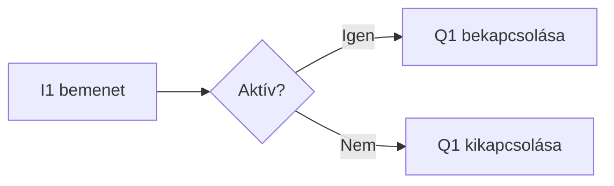

# Q²-Logic – GitHub Markdown formázási mintatár

Ez egy bemutatófájl: a példaszövegek formázást szemléltetnek, nem új termékspecifikációt vagy fejlesztési vállalást jelentenek. A GitHubon a **Preview** a megjelenést, a **Code** vagy **Raw** a másolható forrást mutatja.

A `.md` fájl megjelenése a megjelenítőprogramtól függ. Ez a mintatár a GitHub README-ben használható fő formázásokat, GitHub-kiegészítéseket és néhány engedélyezett HTML-elemet mutatja be. Nem az összes HTML-tag vagy Mermaid-diagramtípus felsorolása.

## Tartalomjegyzék – belső hivatkozások

- [Címsorok](#cimsorok)
- [Szövegformázás](#szoveg)
- [Listák](#listak)
- [Táblázatok](#tablazatok)
- [Lenyitható részek](#lenyithato)
- [Kód és diagramok](#kod)
- [Képek és jelvények](#kepek)
- [Korlátok és források](#korlatok)

<a name="cimsorok"></a>

## 1. Címsorok: hat szint

Az alábbi blokk másolható szintaxisminta. A `#` után szóköz szükséges.

```markdown
# Első szint – dokumentumcím
## Második szint – főfejezet
### Harmadik szint – alfejezet
#### Negyedik szint
##### Ötödik szint
###### Hatodik szint
```

### Harmadik szint élő példája

#### Negyedik szint élő példája

##### Ötödik szint élő példája

###### Hatodik szint élő példája

Az első két szint alternatív jelölése:

```markdown
Első szint
==========

Második szint
------------
```

A GitHub a címsorokból automatikus dokumentumvázlatot és hivatkozható pontokat készít. A fenti tartalomjegyzék külön, kézzel írt navigáció.

<a name="szoveg"></a>

## 2. Szövegformázás

| Formázás | Forrás | Eredmény |
| --- | --- | --- |
| Félkövér | `**fontos**` | **fontos** |
| Félkövér, alternatíva | `__fontos__` | __fontos__ |
| Dőlt | `*megjegyzés*` | *megjegyzés* |
| Dőlt, alternatíva | `_megjegyzés_` | _megjegyzés_ |
| Félkövér és dőlt | `***kiemelt***` | ***kiemelt*** |
| Kombinált | `**fontos és _hangsúlyos_**` | **fontos és _hangsúlyos_** |
| Áthúzott | `~~régi érték~~` | ~~régi érték~~ |
| Aláhúzott | `<ins>aláhúzott</ins>` | <ins>aláhúzott</ins> |
| Felső index | `Q<sup>2</sup>` | Q<sup>2</sup> |
| Alsó index | `U<sub>be</sub>` | U<sub>be</sub> |
| Sorközi kód | `` `System.start()` `` | `System.start()` |
| Billentyű | `<kbd>Ctrl</kbd>` | <kbd>Ctrl</kbd> |

Billentyűkombináció: <kbd>Ctrl</kbd> + <kbd>Shift</kbd> + <kbd>P</kbd>.

## 3. Bekezdés, sortörés és elválasztó

Ez az első bekezdés. A bekezdéseket üres sor választja el.

Ez a második bekezdés.

Ez a sor fordított perjellel végződik.\
Ez már új sor, ugyanabban a bekezdésben.

HTML-sortörés is használható.<br>
Ez a következő sor.

Harmadik lehetőség: két szóköz a sor végén. Ezek a forrásban nehezen láthatók, ezért a fenti példák könnyebben másolhatók.

A következő sor vízszintes elválasztó (`---`):

---

Ugyanez `***` vagy `___` jelöléssel is létrehozható. Hagyj üres sort előtte és utána.

## 4. Idézetek

> Ez egy idézet vagy elkülönített megjegyzés.
>
> Több bekezdést is tartalmazhat, **kiemelésekkel**.
>
> > Ez egy beágyazott idézet.

## 5. GitHub figyelemfelhívó blokkok

> [!NOTE]
> Kiegészítő információ: ez egy formázási példa.

> [!TIP]
> Tipp: a modellek adatait táblázatban könnyű összehasonlítani.

> [!IMPORTANT]
> Fontos: a panel típusát a program fordítása előtt válaszd ki.

> [!WARNING]
> Figyelmeztetés: ez a hely művelet előtti lényeges tudnivalónak használható.

> [!CAUTION]
> Fokozott figyelem: ide kerülhet egy művelet lehetséges kedvezőtlen következménye.

<a name="listak"></a>

## 6. Felsorolások és számozott lépések

- Első felsoroláselem
- Második felsoroláselem
  - Beágyazott elem
  - Másik beágyazott elem
    - Harmadik mélység

A felsorolásjel `-`, `*` vagy `+` is lehet.

1. Nyisd meg az Arduino IDE-t.
2. Válaszd ki a panelt.
3. Fordítsd le a programot.
   - Előtte ellenőrizd a beállításokat.
   - Utána nézd meg a fordítás eredményét.

## 7. Feladatlista

Az állapotok csak minták. A README-ben a forrás szerkesztésével változtathatók.

- [x] Példaszöveg elkészítése
- [x] Táblázat bemutatása
- [ ] Saját fénykép hozzáadása
- [ ] Műszaki adatok véglegesítése

<a name="tablazatok"></a>

## 8. Táblázat és oszlopigazítás

Az elválasztósorban `:---` balra, `:---:` középre, `---:` jobbra igazít.

| Tulajdonság – balra | Mini – középre | Q²-Logic – jobbra |
| :--- | :---: | ---: |
| Mikrovezérlő | ESP32-C3 | ESP32-S3 |
| Bemenetek | 6 | 6 |
| Kimenetek | 6 | 8 |
| Kimenettípusok | 2 relé<br>4 MOSFET | 4 relé<br>4 MOSFET |
| Példa kiemelésre | **Félkövér** | `kódrészlet` |
| Függőleges vonal a cellában | A \| B | C \| D |

A cellán belüli sortöréshez `<br>` használható. A normál Markdown-táblázat nem támogat összevont cellákat.

<a name="lenyithato"></a>

## 9. Lenyitható rész – alapból zárva

<details>
<summary><strong>Q²-Logic Mini</strong> — kattints a műszaki adatokért</summary>

### Q²-Logic Mini

- **Mikrovezérlő:** ESP32-C3
- **Bemenetek:** 6
- **Kimenetek:** 2 relé és 4 MOSFET
- **Kommunikáció:** Wi-Fi

| Kimenet | Típus |
| --- | --- |
| Q1–Q2 | Relé |
| Q3–Q6 | MOSFET |

</details>

Az egész összefoglalósor kattintható. A `<summary>` után és a `</details>` előtt hagyj üres sort a belső Markdown számára.

## 10. Lenyitható rész – alapból nyitva

<details open>
<summary><strong>Telepítési tudnivalók</strong> — kattints az összecsukáshoz vagy megnyitáshoz</summary>

Ez a tartalom már az oldal megnyitásakor látható az `open` attribútum miatt.

</details>

A felirat nem változik automatikusan a nyitott és zárt állapot között.

## 11. Hivatkozások

[Projekt megnyitása](https://github.com/Build-Electric-Kft/Q2-Logic)

[Hivatkozás felugró címmel](https://github.com/Build-Electric-Kft/Q2-Logic "Q²-Logic GitHub-tároló")

Automatikus URL-hivatkozás: <https://github.com/Build-Electric-Kft/Q2-Logic>

[Vissza a táblázathoz](#tablazatok)

[Relatív hivatkozás a csomagindexre](./package_q2_logic_index.json)

[Hivatkozás külön megadott címmel][q2-projekt]

[q2-projekt]: https://github.com/Build-Electric-Kft/Q2-Logic "Q²-Logic"

E-mail-hivatkozás szintaxisa, kizárólag szemléltetésként:

```markdown
[E-mail küldése](mailto:nev@example.com)
```

<a name="kepek"></a>

## 12. Képek, kattintható képek és méretezés

Az alábbi képes példák szándékosan kódblokkok: a hivatkozott helyi képfájlokat előbb hozzá kell adni a tárolóhoz.

```markdown


[](https://github.com/Build-Electric-Kft/Q2-Logic)
```

Méret megadása HTML-lel:

```html

```

Középre rendezett kép és képaláírás:

```html
<p align="center">
  
  <br>
  <em>Q²-Logic Mini – felülnézet</em>
</p>
```

Világos és sötét témához külön kép:

```html
<picture>
  <source media="(prefers-color-scheme: dark)" srcset="docs/images/logo-dark.png">
  <source media="(prefers-color-scheme: light)" srcset="docs/images/logo-light.png">
  
</picture>
```

## 13. Jelvények és emojik

A jelvény is kép, gyakran kattintható hivatkozással. Az alábbi statikus jelvény csak bemutató, nem állapotellenőrzés; külső szolgáltatás jeleníti meg.

[](https://github.com/Build-Electric-Kft/Q2-Logic)

Unicode-emojik: ✅ kész · 🔧 beállítás · 📦 csomag · 📖 dokumentáció

GitHub-rövidkódok: :white_check_mark: :warning: :information_source:

<a name="kod"></a>

## 14. Kódblokkok és szintaxiskiemelés

Sorközi kód: a `System.start()` elindítja a rendszer inicializálását.

C++-kódblokk:

```cpp
void setup() {
  System.start();
}

void loop() {
  if (I1.read()) {
    Q1.on();
  } else {
    Q1.off();
  }
}
```

JSON-kódblokk, szemléltető adatokkal:

```json
{
  "model": "Q2-Logic Mini",
  "inputs": 6,
  "outputs": 6
}
```

Változások kiemelése `diff` jelöléssel:

```diff
- const int ido = 1000;
+ const int ido = 2500;
```

Egyszerű szöveg, rögzített szélességű betűkkel:

```text
Bemenet --> Vezérlési logika --> Kimenet
```

Három backticket tartalmazó példa megjelenítése négy backtick közé zárva:

````markdown
```cpp
Q1.on();
```
````

A kódkerítéshez három tilde (`~~~`) is használható. Négy szóközzel behúzott sorokkal szintén készíthető kódblokk.

## 15. Mermaid-diagram

GitHubon ez a kódblokk rajzként jelenik meg:



A Mermaid többek között folyamatábrát, szekvenciadiagramot, állapotdiagramot és Gantt-diagramot is tud; ezek saját diagramszintaxisok, nem külön Markdown-formázások.

## 16. Matematikai képletek

Sorközi képlet: $P = U \cdot I$.

Külön sorban megjelenített képlet:

$$
I = \frac{U}{R}
$$

Alternatív megadás `math` kódblokkal:

```math
P = I^2 R
```

## 17. Lábjegyzetek

A megadott értékhez magyarázat tartozik.[^pelda]

Egy másik állításhoz hosszabb megjegyzés kapcsolható.[^reszletes]

[^pelda]: Ez egy lábjegyzet, amelyet a GitHub a megjelenített dokumentum alján helyez el.
[^reszletes]: Ez egy hosszabb lábjegyzet első bekezdése.

    Négy szóközzel behúzva további bekezdés is tartozhat hozzá.

## 18. HTML-elrendezés és meghatározáslista

<p align="center"><strong>Q²-Logic</strong><br><em>Középre rendezett bemutatószöveg</em></p>

<dl>
  <dt><strong>Bemenet</strong></dt>
  <dd>Külső jel állapotának beolvasására szolgáló csatlakozás.</dd>
  <dt><strong>Kimenet</strong></dt>
  <dd>A program által vezérelt csatlakozás.</dd>
</dl>

Összevont cellák HTML-táblázattal:

<table>
  <tr><th colspan="2">Q²-Logic család</th></tr>
  <tr><td>Mini</td><td>ESP32-C3</td></tr>
  <tr><td>Q²-Logic</td><td>ESP32-S3</td></tr>
</table>

HTML-blokkon belül használd a HTML-formázást, például `<strong>`; ott a Markdown feldolgozására nem minden helyzetben lehet számítani.

## 19. Megjegyzések és speciális karakterek

<!-- Ez a megjegyzés a forrásban olvasható, a formázott nézetben nem. Nem alkalmas titkok elrejtésére. -->

Az előző sor egy HTML-megjegyzés: csak a forrásban látható.

Formázás elkerülése fordított perjellel:

\*Ez nem dőlt szöveg.\*

\# Ez nem címsor.

HTML-karakterhivatkozások: &lt;tag&gt; · &amp; · &copy; · 5&nbsp;A

Backtick megjelenítése sorközi kódban: `` `példa` ``.

## 20. Speciális GitHub-megjelenítők

A GitHub `geojson`, `topojson` és `stl` kódblokkokat is képes megjeleníteni térképként, illetve 3D-ábraként. Ezek egy vezérlő README-jében ritkán szükségesek.

GeoJSON-példa – egy szemléltető térképpont Budapesten, nem a projekt telephelye:

```geojson
{
  "type": "FeatureCollection",
  "features": [
    {
      "type": "Feature",
      "properties": { "name": "Szemléltető pont" },
      "geometry": { "type": "Point", "coordinates": [19.0402, 47.4979] }
    }
  ]
}
```

TopoJSON-példa ugyanarra a pontra:

```topojson
{
  "type": "Topology",
  "objects": {
    "pelda": { "type": "Point", "coordinates": [19.0402, 47.4979] }
  },
  "arcs": []
}
```

ASCII STL-példa – egyetlen háromszög, nem zárt gyártható test:

```stl
solid pelda
  facet normal 0 0 1
    outer loop
      vertex 0 0 0
      vertex 10 0 0
      vertex 0 10 0
    endloop
  endfacet
endsolid pelda
```

<a name="korlatok"></a>

## 21. Ami nem általános README-formázás

- A GitHub a HTML-t megszűri: saját JavaScript, tetszőleges CSS, űrlap vagy iframe nem használható úgy, mint egy saját weboldalon.
- Tetszőleges betűszín, betűtípus és háttér nem állítható be megbízhatóan Markdownnal. A jelvények és képek adhatnak színt.
- A `==kiemelés==`, a `: meghatározás` és a `[TOC]` nem beépített GitHub README-szintaxis.
- A `#123` issue-hivatkozás, a commitok automatikus linkelése, a megemlítések és a kódszín-minták működése GitHub-felülettől függ. README-ben konkrét linket használj; a színkód mellett megjelenő színminta az issue/PR/discussion felületek szolgáltatása.
- A videókhoz és hangfájlokhoz a biztosan hordozható megoldás a hivatkozás vagy egy kattintható előnézeti kép. Az automatikus médialejátszó nem általános Markdown-funkció.
- A diagramok, képletek és figyelemfelhívó blokkok egy egyszerű helyi Markdown-nézőben eltérően jelenhetnek meg. A célmegjelenítő itt a GitHub.

## Források

- [GitHub: alapvető írási és formázási szintaxis](https://docs.github.com/en/get-started/writing-on-github/getting-started-with-writing-and-formatting-on-github/basic-writing-and-formatting-syntax)
- [GitHub: haladó formázások](https://docs.github.com/en/get-started/writing-on-github/working-with-advanced-formatting)
- [GitHub: lenyitható részek](https://docs.github.com/en/get-started/writing-on-github/working-with-advanced-formatting/organizing-information-with-collapsed-sections)
- [GitHub: diagramok, térképek és STL](https://docs.github.com/en/get-started/writing-on-github/working-with-advanced-formatting/creating-diagrams)
- [GitHub Flavored Markdown specifikáció](https://github.github.com/gfm/)

