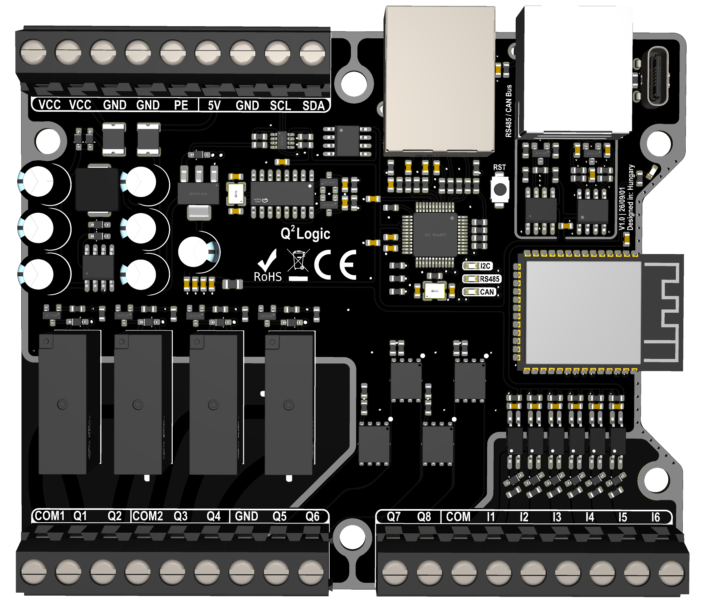
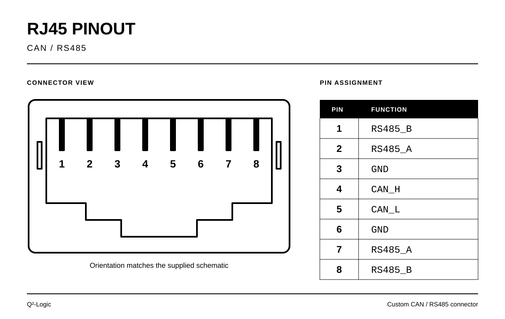
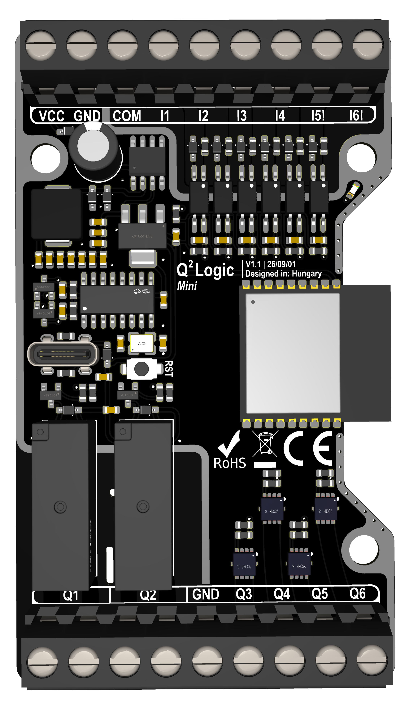

# Q²-Logic
Q²-Logic (Q2-Logic) is a family of ESP32-based programmable controllers developed by Build Electric Kft. This repository provides hardware specifications, Arduino board package installation instructions, and library documentation for Q²-Logic and Q²-Logic Mini.

## Models:
| | <ins>Q²-Logic</ins> | <ins>Q²-Logic Mini</ins> |
| :--- | :---: | :---: |
| **Supply voltage** | 12-24VDC | 12-24VDC |
| **Input** | 6 | 6 | 
| **Relay output** | 4 | 2 |
| **MOSFET output** | 4 | 4 |
| **Program upload** | USB-C | USB-C |
| **Interface** | Wifi, Ethernet, CAN, RS485, I²C | Wifi |
| **Core** | ESP32-S3-N16 | ESP32-C3-N4 |
> [!NOTE]
> Relay: *5A/ch | 250VAC*\
> MOSFET: *5A/ch, or max:15A (all chanel) | 30VDC*
>> Maximum temperature at full load: 70 °C

> [!WARNING]
> Do not exceed the maximum rated current, as this may damage the controller!

---

<details>
<summary><strong><ins>Q²-Logic</ins></strong> — Click for a detailed description.</summary>

###
  
<details>
<summary><strong><ins>Board preview</ins></strong> — Click for a PCB</summary>

  
  
</details>

# Q²-Logic

### <ins>General specifications</ins>

- **Microcontroller:** ESP32-S3
- **Board dimensions:** 102 × 86 mm

### <ins>Power supply</ins>

- **Nominal input voltage:** 12–24V DC
- **Minimum input voltage:** 10V DC
- **Absolute maximum input voltage:** 30V DC
- **Reverse-polarity protection**
- **Input current:** 800mA
- **5V output:** maximum current 1A
- **DC/DC converter IC ESD rating:** 2kV HBM (component level)

### <ins>Digital inputs</ins>

- **6 isolated digital inputs**
- **Input voltage between COM and each input:** 10–24V DC

### <ins>Relay outputs</ins>

- **4 relay outputs**
- **Maximum switching current:**
  - 5A at 250V AC
  - 1A at 30V DC

### <ins>MOSFET outputs</ins>

- **4 N-channel MOSFET outputs**
- **Maximum load current:** 5A per channel, with a combined limit of 15A across all four channels
- **Maximum voltage:** 30V DC
- **PWM frequency:** 1.2kHz
- **Maximum temperature at full load:** 70°C

### <ins>Ethernet</ins>

- **Controller:** W5500
- **Link speed:** 10/100Mbps
- **Full- and half-duplex support**
- **Auto-negotiation**

### <ins>CAN bus</ins>

- Multi-master communication: any node can initiate transmission
- Built-in message arbitration and error detection
- Maximum node count depends on the transceivers and network configuration
- On-board 120Ω termination resistor
- Dedicated PESD1CAN TVS protection against ESD and voltage transients

### <ins>RS485</ins>

- Differential communication supporting multiple devices on a shared bus
- Master/slave operation depends on the protocol implemented in firmware
- Maximum node count depends on transceiver loading and protocol limitations
- On-board 120Ω termination resistor
- Dedicated PESD1CAN TVS protection against ESD and voltage transients

> [!NOTE]
> The PESD1CAN protection diodes are rated for 23kV contact discharge under IEC 61000-4-2. This is a component rating, not a verified ESD immunity rating for the complete board.
>
> Bus termination should be fitted at the two physical ends of each bus.

### <ins>I²C</ins>

- **Logic level:** 5V
- **Bus speed:** 100kHz Standard-mode / 400kHz Fast-mode
- **On-board EEPROM:** AT24C08C, 8Kbit (1KB) 7-bit I²C addresses: `0x50`–`0x53`
- **Level translator IC ESD rating:** 5kV HBM (component level)

The P3 connector uses **pin 1: GND, pin 2: SCL, pin 3: SDA**. Both signal lines
connect through a 3.3 V / 5 V level translator. The board has 5.1 kΩ pull-up
resistors on each side of the translator.

When linking two panels, connect GND to GND, SCL to SCL and SDA to SDA, keep
the wires short and power both panels. Their EEPROMs share `0x50`–`0x53` and
cannot be selected independently by software. Do not access these EEPROM
addresses while the panels are linked: a write can affect both memories and
their read responses overlap. The four addresses select the AT24C08C's memory
blocks, as described in the [Microchip device addressing documentation](https://onlinedocs.microchip.com/oxy/GUID-84DB5234-25BE-4966-B7FA-22A50FA88666-en-US-2/GUID-110F0699-5F83-4370-8015-66ED45949E98.html).

### <ins>ESP32-S3 IO definition</ins>
| **IO** | **Name** | **Description** | | **IO** | **Name** | **Description** |
| --- | --- | --- | --- |--- | --- | --- |
| GPIO0 | IO0 | Boot | | GPIO18 | RS485_DIR_pin | RS485 direction |
| GPIO1 | I6_pin | Input 6 | | GPIO19 | I2C_SDA_pin | I²C data |
| GPIO2 | I5_pin | Input 5 | | GPIO20 | I2C_OE_pin | I²C translator enable |
| GPIO3 | ETH_RST_pin | W5500 reset | | GPIO21 | Q1_pin | Output 1 |
| GPIO4 | CAN_LED_pin | CAN status LED | | GPIO35 | Q8_pin | Output 8 |
| GPIO5 | RS485_LED_pin | RS485 status LED | | GPIO36 | Q6_pin | Output 6 |
| GPIO6 | I2C_LED_pin | I²C status LED | | GPIO37 | Q5_pin | Output 5 |
| GPIO7 | CAN_RX_pin | CAN receive | | GPIO38 | Q7_pin | Output 7 |
| GPIO8 | I2C_SCL_pin | I²C clock | | GPIO39 | I1_pin | Input 1 |
| GPIO9 | ETH_SCL_pin | W5500 SPI clock | | GPIO40 | I2_pin | Input 2 |
| GPIO10 | ETH_MOSI_pin | W5500 SPI data out | | GPIO41 | I3_pin | Input 3 |
| GPIO11 | ETH_CS_pin | W5500 chip select | | GPIO42 | I4_pin | Input 4 |
| GPIO12 | — | Not connected | | GPIO43 | TX | UART0 transmit |
| GPIO13 | — | Not connected | | GPIO44 | RX | UART0 receive |
| GPIO14 | — | Not connected | | GPIO45 | Q4_pin | Output 4 |
| GPIO15 | CAN_TX_pin | CAN transmit | | GPIO46 | ETH_MISO_pin | W5500 SPI data in |
| GPIO16 | RS485_TX_pin | RS485 transmit | | GPIO47 | Q2_pin | Output 2 |
| GPIO17 | RS485_RX_pin | RS485 receive | | GPIO48 | Q3_pin | Output 3 |

### <ins>RJ45 - CAN/RS485 pinout</ins>
<details>
<summary><strong><ins>RJ45 - CAN/RS485 pinout</ins></strong> — Click</summary>


  
</details>

| **Pin** | **Signal** | | **Pin** | **Signal** |
| :---: | --- | --- | :---: | --- |
| 1 | RS485_B | | 5 | CAN_L |
| 2 | RS485_A | | 6 | GND |
| 3 | GND | | 7 | RS485_A |
| 4 | CAN_H | | 8 | RS485_B |

</details>

---

<details>
<summary><strong><ins>Q²-Logic Mini</ins></strong> — Click for a detailed description.</summary>

###
  
<details>
<summary><strong><ins>Board preview</ins></strong> — Click for a PCB</summary>

  
  
</details>

# Q²-Logic Mini

### <ins>General specifications</ins>

- **Microcontroller:** ESP32-C3
- **Board dimensions:** 50 × 86 mm

### <ins>Power supply</ins>

- **Nominal input voltage:** 12–24V DC
- **Minimum input voltage:** 10V DC
- **Absolute maximum input voltage:** 30V DC
- **Reverse-polarity protection**
- **Input current:** 800mA
- **DC/DC converter IC ESD rating:** 2kV HBM (component level)

### <ins>Digital inputs</ins>

- **6 isolated digital inputs**
- **Input voltage between COM and each input:** 10–24V DC
  
> I5 and I6 must not be active during upload!

### <ins>Relay outputs</ins>

- **2 relay outputs**
- **Maximum switching current:**
  - 5A at 250V AC
  - 1A at 30V DC

### <ins>MOSFET outputs</ins>

- **4 N-channel MOSFET outputs**
- **Maximum load current:** 5A per channel, with a combined limit of 15A across all four channels
- **Maximum voltage:** 30V DC
- **PWM frequency:** 1.2kHz
- **Maximum temperature at full load:** 70°C

### <ins>ESP32-C3 IO definition</ins>
| **IO** | **Name** | **Description** | | **IO** | **Name** | **Description** |
| --- | --- | --- | --- | --- | --- | --- |
| GPIO0 | Q6_pin | Output 6 | | GPIO8 | I6_pin | Input 6 |
| GPIO1 | Q5_pin | Output 5 | | GPIO9 | IO9 | Boot / GPIO |
| GPIO2 | I5_pin | Input 5 | | GPIO10 | Q2_pin | Output 2 |
| GPIO3 | Q4_pin | Output 4 | | GPIO18 | Q1_pin | Output 1 |
| GPIO4 | I4_pin | Input 4 | | GPIO19 | Q3_pin | Output 3 |
| GPIO5 | I3_pin | Input 3 | | GPIO20 | RX | UART0 receive |
| GPIO6 | I2_pin | Input 2 | | GPIO21 | TX | UART0 transmit |
| GPIO7 | I1_pin | Input 1 | | | | |

</details>

---

# Arduino board package installation

The Q²-Logic library is included in the board package and does not need to be installed separately.

1. Open **Arduino IDE**.
2. Go to **File → Preferences** and add both URLs to **Additional Boards Manager URLs** (one per line in the list editor):

   ```text
   https://raw.githubusercontent.com/Build-Electric-Kft/Q2-Logic/main/package_q2_logic_index.json
   https://espressif.github.io/arduino-esp32/package_esp32_index.json
   ```

3. Open **Tools → Board → Boards Manager**.
4. Search for **esp32** and install **esp32 by Espressif Systems**, version **3.3.11** for this Q²-Logic release.
5. Search for **Q²-Logic Boards** and install the package.
6. Under **Tools → Board → Q²-Logic Boards**, select **Q²-Logic** or **Q²-Logic Mini** to match your controller.
7. Select the connected controller under **Tools → Port**.

The Q²-Logic API is now available in your sketch without an additional `#include`.

## Q²-Logic Mini System API

Select **Q²-Logic Mini** to make `System`, `I1`–`I6` and `Q1`–`Q6` available
without an additional `#include`. The Mini runs its ESP32-C3 at **160 MHz**.
Q1–Q2 are relays: any nonzero duty means fully on. Q3–Q6 support PWM from
0 to 255 at 1.2 kHz.

Call `System.start()` once in `setup()` to initialize the board and disable
Arduino's default task watchdog. `System.start(5000)` explicitly enables a
5-second watchdog; call `System.wdt_rst()` from the same task before it expires.
Repeated starts update only the watchdog setting and preserve active outputs
and timers. Pulses and flashing run asynchronously, as on the larger board.

`I1.read()` is retained for existing Mini sketches and is equivalent to
`I1.read(NO)`. Both read immediately. Earlier Mini versions implicitly delayed
`read(NO)` by 50 ms; use `read(NO, 50)` for that two-sample behavior. This call
blocks for 50 ms and keeps the previous state if the two samples differ.

English descriptions and parameter details appear on hover in Arduino IDE 2
and in [`Q2_Logic_System.h`](variants/q2_logic_mini/Q2_Logic_System.h).
The bus APIs below target the ESP32-S3 model.

## Q²-Logic System, RS485, Modbus RTU, I2C and CAN API

Select the **Q²-Logic** board to make `System`, `I1`–`I6`, `Q1`–`Q8`, `RS485`,
`ModbusRTU`, `I2C` and `CAN` available automatically. The following notes apply to the
ESP32-S3 model.

Hover over a function in Arduino IDE 2 to see its description, parameter units,
valid values, and return value. The public declarations in
[`Q2_Logic_System.h`](variants/q2_logic/Q2_Logic_System.h),
[`Q2_RS485.h`](variants/q2_logic/Q2_RS485.h),
[`Q2_ModbusRTU.h`](variants/q2_logic/Q2_ModbusRTU.h),
[`Q2_I2C.h`](variants/q2_logic/Q2_I2C.h) and
[`Q2_CAN.h`](variants/q2_logic/Q2_CAN.h) contain the same documentation.

- Call `System.start()` in `setup()` to initialize the board with the task watchdog
  disabled. `System.start(5000)` enables a 5-second watchdog for the calling task;
  call `System.wdt_rst()` from that same task before the timeout expires.
- Repeating `System.start(...)` changes the watchdog setting without resetting
  outputs or restarting active pulses and flashing. Do not combine it with another
  library that manages the ESP-IDF task watchdog.
- `onPulse()`, `offPulse()`, and `flashing()` run asynchronously. Call a timed
  operation once to start it; calling it repeatedly restarts its timing.
  `on()`, `off()`, and `pwm()` cancel the timed operation.
- Q1–Q4 are relay outputs: every nonzero duty means fully on. Q5–Q8 support PWM
  values from 0 to 255. Output `read()` returns the commanded duty, not feedback
  from the connected load.
- `I1.read(NO, 20)` takes two samples 20 ms apart and blocks during that interval.
  Reading several inputs this way adds their delays.
- `RS485.begin(9600, 8, 0, 1)` selects 9600 baud, 8 data bits, no parity, and one
  stop bit. Check its Boolean result before using the bus.
- `RS485.write(...)` accepts data for asynchronous transmission; its return value
  is the number of bytes accepted. Check `RS485.flush(timeout_ms)` when you need
  to wait for completion. Account for blocking calls when choosing a watchdog timeout.
- `RS485.read()` returns an `int`: 0–255 for a received byte, or **-1** if there is
  no byte or the bus is stopped. Store the result in an `int` before checking it;
  this distinguishes a real `0x00` byte from an empty receive buffer.

### Modbus RTU master

`ModbusRTU` sends a request and waits for one slave's response on the built-in
RS485 port. Call `System.start()` first, then
`ModbusRTU.begin(9600, SERIAL_8E1, 500)`. All three arguments are required: baud
rate, Arduino serial configuration and response timeout in milliseconds.
Use matching settings on every device. `SERIAL_8E1` and `SERIAL_8N2` provide the
usual RTU character formats; `SERIAL_8N1` is also accepted for devices that require it.

The interface supports slave IDs **1–247**. Broadcast address 0 and slave/server
operation are not part of this API. Register and bit addresses are **zero-based**:
use address `0` for a device manual's holding register `40001`, when that manual
uses the traditional register notation.

| Method | Function code | Maximum count per request |
| --- | --- | --- |
| `readCoils()` | 01 | 2000 bits |
| `readDiscreteInputs()` | 02 | 2000 bits |
| `readHoldingRegisters()` | 03 | 125 registers |
| `readInputRegisters()` | 04 | 125 registers |
| `writeSingleCoil()` | 05 | One bit |
| `writeSingleRegister()` | 06 | One register |
| `writeMultipleCoils()` | 15 (0x0F) | 1968 bits |
| `writeMultipleRegisters()` | 16 (0x10) | 123 registers |

Bit arrays use one `bool` per bit; register arrays use one `uint16_t` per register.
The caller supplies an array with at least `count` elements. A failed read leaves
the entire destination array unchanged. A failed write can still have reached
the slave: requests are never retried automatically.

**Always compare results with `MODBUS_OK`.** The result is an enum, not a Boolean;
error codes can also be nonzero. `MODBUS_NOT_READY` means the port is stopped or
another Modbus call owns it. `MODBUS_INVALID_ARGUMENT` rejects invalid arguments
without sending a request. Other results distinguish timeout, CRC/response
errors, slave exceptions and transport failures. After `MODBUS_TRANSPORT_ERROR`,
call `begin()` successfully before using the bus again.

Operations block the calling task and yield while waiting. The response timeout
starts after transmission and must allow the complete response and its closing
quiet interval to be observed. Task scheduling delays count toward this deadline.
Transmission, waiting for bus silence and recovery after a communication error
can add time to a call. Choose a watchdog timeout accordingly. A single shared
lock protects all Modbus instances. Do not call `RS485` directly while using
`ModbusRTU`; call `ModbusRTU.end()` before switching to raw RS485.

The receiver checks CRC, address, function, length, byte count and write echoes.
It observes an idle interval before sending and drains stale received data.
Because the RS485 API provides buffered bytes without arrival timestamps,
physical inter-character timing cannot be checked precisely. Modbus RTU also
has no transaction identifier: an arbitrarily late reply identical in shape to
a later request's reply cannot always be distinguished.

Example: read two holding registers once per second. Change slave ID, addresses
and serial settings to match the connected device. No additional include is needed.

```cpp
void setup() {
  System.start();
  if (ModbusRTU.begin(9600, SERIAL_8E1, 500) != MODBUS_OK) {
    Serial.println("Modbus initialization failed");
    while (true) delay(1000);
  }
}

void loop() {
  uint16_t values[2];
  const Q2ModbusResult result = ModbusRTU.readHoldingRegisters(1, 0, 2, values);
  if (result == MODBUS_OK) {
    Serial.printf("Registers: %u, %u\n", values[0], values[1]);
  } else {
    Serial.printf("Modbus error: %u\n", static_cast<unsigned>(result));
  }
  delay(1000);
}
```

Function layouts and quantity limits follow the
[Modbus Application Protocol Specification V1.1b3](https://www.modbus.org/file/secure/modbusprotocolspecification.pdf).

### I2C master and slave

`I2C` provides a Wire-style interface for the board's I2C port. Call
`System.start()` first. `I2C.begin()` starts a master at **100 kHz** on SDA
GPIO19 and SCL GPIO8; `I2C.begin(uint8_t(0x42))` starts a slave at 7-bit address
`0x42`. Check the Boolean result before using the port. The board wrapper
controls the level translator and communication LED.

Use one master on the connected bus. Use the global `I2C` object; do not also
use `Wire`, `Wire1` or another I2C object on the same controller or pins. For
two linked Q2-Logic panels, choose a slave address such as `0x42` and send a STOP
with a processing pause between writing a request and reading its reply.
Both onboard EEPROMs have the same address; avoid scanning or accessing
EEPROM addresses `0x50`–`0x57` while the two panels share the bus.

> [!IMPORTANT]
> **Repeated START transfers to a Q2 slave are unreliable and unsupported with
> Arduino-ESP32 3.3.11.** Our two-panel hardware tests observed both previous-command
> replies and failed reads, including failures when the reply had been prepared
> beforehand. Use `endTransmission(true)` to send STOP, allow processing time
> (`delay(2)` worked in our short-packet tests), then read separately. The driver can invoke
> `onRequest()` before `onReceive()`; waiting inside a callback cannot fix that
> ordering. The related [upstream report #12467](https://github.com/espressif/arduino-esp32/issues/12467)
> describes stale replies on core 3.3.7; the broader failures above were observed
> in our 3.3.11 tests. Master repeated START remains available for other
> peripherals that support it.

#### Initialization and settings

| Method | Parameters and result |
| --- | --- |
| `begin()` | Start a 100000 Hz master on the configured pins; returns `true` on success. |
| `begin(uint8_t(address))` | Start a slave for a 100000 Hz master. Address must be `0x08`–`0x77`, excluding `0x50`–`0x57`; returns `true` on success. |
| `begin(sda, scl, frequency)` | Start a master with explicit output-capable, different GPIOs. `-1` retains a configured pin. Frequency is 1000–1000000 Hz; `0` selects 100000 Hz. Returns `true` on success. |
| `begin(uint8_t(address), sda, scl, frequency)` | Start a slave with the same pin and frequency rules; frequency is the expected master's clock. The same slave address limits apply. Returns `true` on success. |
| `end()` | Stop this object's driver, discard data, cancel its pending write and disable the board connector/LED. Settings and callbacks remain. Returns `true` on success or when already stopped. |
| `setPins(sda, scl)` | Save valid, different output-capable GPIOs while stopped; `-1` keeps that pin. Returns `false` if running, busy or invalid. |
| `setClock(frequency)` | Change an active master's clock; same frequency limits as `begin()`. Returns `false` when stopped, in slave mode, busy, invalid or a transaction is pending. |
| `getClock()` | Return the active master's clock in Hz, or `0` when stopped, in slave mode, busy or unsuccessful. |
| `setBufferSize(bytes)` | Set each RX/TX buffer to 32–4096 bytes while stopped; default 128. Returns the requested size on success, otherwise `0`. Allocation failure preserves the previous buffers. |
| `setTimeOut(milliseconds)` | Set the hardware timeout from 0–65535 ms; default 50. Zero permits no waiting. Ignored when busy or a transaction is pending. |
| `getTimeOut()` | Return the hardware timeout in ms, or `0` when busy. |
| `getBusNum()` | Return the controller index; the global object uses controller `0`. |

Call `end()` before changing an active mode, pin assignment or slave address.
Repeating `begin()` with an identical active configuration succeeds without
restarting it; a different configuration fails. Initialization also fails if
`System.start()` has not run, the controller is already owned, or resources are
unavailable. `end()` can fail when busy, called from a callback, another task
owns a pending transaction, or driver shutdown fails.

The API's frequency range is broader than the board connector's specified
**100 kHz / 400 kHz** modes. Start with 100 kHz and select a rate supported by
every connected device. Pins already attached to a different peripheral are
rejected before initialization. Custom GPIO assignments do not enable the board
connector or its LED. The constructor `Q2I2C(bus_num)` associates another object
with a hardware controller; other controllers require explicit pins, and only
one object may own a controller. Its destructor releases its resources; never
destroy an object while another task or callback is using it. For a local active
object, call `end()` and check its result before destruction when shutdown errors
need to be handled.

`setTimeOut()` controls hardware transfers. The inherited `Stream.setTimeout()`
has a different purpose: it controls stream parsing helpers. Configuration and
lifecycle methods are not callback operations.

#### Master transfers and status codes

Prepare a write with `beginTransmission(address)`, append bytes with
`write(value)` or `write(data, count)`, then send it with `endTransmission()`.
`write()` returns the number of bytes accepted into the transmit buffer;
check this count as well as the final status. A buffer overflow rejects the
whole write instead of sending a truncated prefix. Master addresses are
7-bit values from `0x08` to `0x77`. `beginTransmission()` does not touch the bus;
another call from the same task replaces its previous unsent write.
`write(value)` returns `1` or `0`; `write(data, count)` accepts a byte array.
A null array with nonzero count also invalidates the whole write.

| `endTransmission()` result | Meaning |
| --- | --- |
| `0` | Success. With `endTransmission(false)`, the write is only buffered for a later combined transfer. |
| `1` | Transmit buffer overflow; nothing from this transfer was sent. |
| `2` | The slave did not acknowledge. |
| `4` | Invalid state or arguments, busy access, or another bus error. |
| `5` | Operation timed out. |

`requestFrom(address, count)` returns the number of bytes received. Require
the expected count before consuming the reply with `available()`, `read()`
and `peek()`. `read()` consumes one byte; `peek()` leaves it buffered. Both
return **-1** when empty, so keep the result in an `int` to distinguish an
empty buffer from the valid byte `0x00`. Requested counts must be from `1` to
the configured buffer capacity. Invalid requests and transfer failures return
`0`; a failed call owned by the current task clears its RX buffer. `available()`
returns the unread count, or `0` when empty, stopped, busy or inaccessible.
Consume a reply before starting another operation, because RX is shared.

For a peripheral that supports a combined write/read with repeated START, call
`endTransmission(false)`, then `requestFrom(theSameAddress, count, true)` from
the same task. The first call defers the prefix; the second performs the
combined transfer and sends STOP. `requestFrom(..., false)` is unsupported:
it returns zero and cancels the caller's pending prefix. For a Q2 slave, use the
separate write-with-STOP and read sequence described above, even if its reply
has already been prepared.

`flush()` discards RX/TX data and cancels the calling task's unsent transaction.
It does not transmit anything, wait for transmission, or send STOP. It has no
effect when busy, called from a callback, or another task owns the transaction.

#### Slave callbacks and task ownership

Register `onReceive(callback)` and `onRequest(callback)` **before** starting
slave mode. The receive callback takes an `int` byte count and reads the
buffered request using `available()` and `read()`. The request callback takes
no arguments and fills the reply using `write()`. Validate request lengths
and check how many reply bytes `write()` accepted. Slave RX is available only
inside `onReceive()`; each `onRequest()` starts with an empty reply buffer.
An overflowing reply is not queued. The lower driver can also lose received
data on overflow, so an application protocol must check length and integrity.
Pass an empty callback to disable a handler; registration is ignored while
busy or inside a callback.

The advanced `slaveWrite(data, count)` method queues a prepared reply directly
in the driver. The non-null array must contain `1` to the configured buffer
capacity bytes. It returns the accepted count, or `0` on invalid input,
unavailable access or when not running as a slave. It can be called from task
context or `onRequest()`, but do not mix it with buffered `write()` in the same
callback. Queuing a reply does not mean the master has received it.

Callbacks run in the ESP32 driver's task context, not in an interrupt. Keep
them short: no Serial printing, delays, bus reconfiguration, `end()`, or master
transactions. Copy shared data or counters under a short critical section
and print from `loop()`.

Individual API calls are protected, but a sequence of calls is not one atomic
operation. Use one application task for master transfers, or externally
serialize the entire sequence from `beginTransmission()` through reading the
response. A different task cannot finish another task's pending transmission.
Concurrent access can fail immediately; it does not queue another transaction.

### Classic CAN bus

`CAN` uses the ESP32-S3 CAN controller and the onboard SN65HVD230 transceiver.
Call `System.start()` first, then `CAN.begin(500000)` for normal operation at
**500 kbit/s**. The fixed pins are **TX GPIO15, RX GPIO7 and activity LED GPIO4**.
This API supports **Classic CAN**, standard 11-bit and extended 29-bit identifiers,
data frames and remote request frames. **CAN FD is not supported**; data frames
carry at most eight bytes. No higher-level protocol, automatic application reply
or message identifier allocation is imposed.

Connect **CAN_H to CAN_H**, **CAN_L to CAN_L**, and **GND to GND**. On the
**CAN/RS485 RJ45** socket, **pin 4 is CAN_H, pin 5 is CAN_L and pins 3/6 are GND**.
Use the CAN/RS485 socket, not the Ethernet socket. Each Q2-Logic has fixed
**120-ohm termination**; two panels at the two ends of a short bus already
provide both terminators. Do not add another terminating resistor to that pair.
A short straight-through cable connects the sockets correctly. USB supplies the
CAN transceiver and is sufficient when testing communication without external
loads. For a larger network, account for the fixed termination on every panel:
a CAN bus should have termination only at its two ends.

#### Frames and bus settings

`CANFrame` has these fields; default initialization sets all of them to zero or
false:

| Field | Meaning and accepted values |
| --- | --- |
| `uint32_t id` | `0`–`0x7FF` for a standard frame; `0`–`0x1FFFFFFF` when `extended` is true. |
| `uint8_t length` | Data length code, `0`–`8`. For a remote request it is the requested reply length. |
| `uint8_t data[8]` | Payload bytes. Only the first `length` bytes are transmitted; ignored for a remote frame. |
| `bool extended` | False for an 11-bit identifier, true for a 29-bit identifier. |
| `bool remote` | False for a data frame, true for a remote request frame. A remote request does not generate an application reply automatically. |

On ESP32-S3 with **ESP-IDF 5.5.5**, received Classic CAN raw DLC values `9`–`15`
are normalized to `length = 8`. Data frames still carry at most eight bytes;
remote frames carry no payload. This does not add CAN FD support. `write()`
accepts only lengths `0`–`8`.

Use `CANFrame frame{};` to initialize a frame before filling its ID, length and
payload. The transmit queue holds **16 waiting frames plus the active frame**;
the receive queue holds **32 frames**. Read received frames regularly to avoid overflow; this API accepts
all standard and extended identifiers, so select relevant IDs in your application.

`begin(bitrate = 500000, listenOnly = false)` accepts **25000, 50000, 100000,
125000, 250000, 500000, 800000 or 1000000 bits/s**. Every connected node must use
the same bitrate. Normal mode transmits, receives and acknowledges valid frames.
Listen-only mode receives without transmitting or sending ACKs; `write()` fails
in this mode. Use the global `CAN` object and do not install another TWAI/CAN
driver on the same controller.

Calling `begin()` again with identical active settings succeeds without resetting
the bus. Use a successful `end()` before changing an active configuration.
The activity LED pulses for successfully transmitted or received traffic;
acceptance into the transmit queue alone does not light it.

#### Operations and return values

All timeouts are in **milliseconds**. A timeout of zero checks immediately.
Task scheduling can delay completion beyond the requested wait.
Check the Boolean result of operations; a failed `read()` or `getStatus()` leaves
its output object unchanged.

| Method | Result and behavior |
| --- | --- |
| `begin(bitrate = 500000, listenOnly = false)` | Start the controller; false for invalid settings or an unavailable resource. |
| `end()` | Stop and release the controller, discarding queued frames; succeeds if already uninstalled. May interrupt an active frame, so flush first when traffic must finish. Failure retains ownership for a later cleanup attempt. |
| `write(frame, timeoutMs = 0)` | Queue a valid frame; wait at most the specified timeout for queue space. True means accepted, not transmitted or processed by another application. |
| `read(frame, timeoutMs = 0)` | Read the next frame, waiting up to the timeout when the queue is empty. False leaves `frame` unchanged. |
| `available()` | Number of queued received frames; returns zero when none are available or access is unavailable. |
| `flush(timeoutMs = 1000)` | Wait for physical transmit completion and check driver transmission failures. False on timeout, bus-off or a newly reported failed transmission. It does not discard pending frames. |
| `clearRX()` | Discard the queued received frames without transmitting anything. |
| `getStatus(status)` | Copy controller state, queue counts and error counters. With no installed driver, succeeds with a zeroed status and `Stopped` state. |
| `recover(timeoutMs = 1000)` | Explicitly initiate or complete bus-off recovery, discard pending TX/RX and restart when recovery completes. Already Running also succeeds without recovery. Queued requests are never replayed. |

The CAN controller automatically retries normal transmissions until they
succeed or the controller enters bus-off. At least one other active node must
acknowledge a frame; a lone transmitter or a listen-only peer cannot do this.
`flush()` returning true confirms completion without a newly reported driver
transmission failure. It does **not** identify which peer acknowledged the frame
or prove that its application handled it. Use sequence numbers and an application
reply when that confirmation matters.

`flush()` tracks the driver's failed-transmission count since `begin()`, recovery,
or the previous completed flush. If an idle flush observes a new failure, it
returns false and advances that checkpoint; the same failure is not reported
indefinitely. A timeout or bus-off leaves queued frames pending. Do not blindly
repeat an application operation after a failure: a frame may already have reached
the peer. Check the failure and controller status before deciding whether to
restart communication.

#### Status and recovery

`CANStatus.state` is one of `CANState::Stopped`, `Running`, `BusOff` or
`Recovering`. `Running` also includes error-warning and error-passive operation.
`txQueued` includes the frame awaiting transmission completion; `rxQueued` is
the queued receive count. The counters belong to the installed driver and reset
when it is reinstalled, rather than after each call.
`txErrorCounter` and `rxErrorCounter` are the controller's current error counters.
`txFailed`, `rxMissed`, `rxOverrun`, `arbitrationLost` and `busErrors` report driver
event counters. Arbitration loss is part of normal bus sharing and is not by
itself a failed application operation.

There is **no automatic bus-off recovery** in this API. Correct the cause, then
call `recover(timeoutMs)` explicitly. A recovery timeout can leave the controller
in `Recovering`; check status and call `recover()` again to finish. Recovery
discards pending transmissions and clears received frames when the controller
restarts. `end()` cannot uninstall the driver while recovery is still in progress;
retry cleanup after it completes. Recovery cannot decide whether an earlier application request already took
effect. Reinitialize your application's transaction state before sending more.

Use the API from application tasks, not interrupts. Individual calls are
protected, but a multistep exchange is not one atomic operation; use one task or
externally serialize the full exchange. Waiting calls release the shared lock
while waiting, and `end()`, restart or recovery cancels those waits. Another
object owning the controller or unavailable access causes calls to fail rather
than taking over the hardware. Account for blocking calls when enabling a
watchdog.

Prefer the global `CAN` object. If you create a local `CANClass`, stop all tasks
using it and check that `end()` succeeds before its lifetime ends.

#### CAN compatibility note for package maintainers

Keep [`Q2_CAN_compat.cpp`](variants/q2_logic/Q2_CAN_compat.cpp) and the
`--wrap=twai_hal_parse_frame` linker option in [`boards.txt`](boards.txt) together.
They protect the ESP32-S3 **ESP-IDF 5.5.5** receive path from an invalid memory
clear length when a Classic frame carries raw DLC `9`–`15`; see the
[upstream receive implementation](https://github.com/espressif/esp-idf/blob/v5.5.5/components/driver/twai/twai.c).
The normalization applies only to that exact target and SDK version. Other SDK
versions pass through unchanged and require separate verification before a
release. The compile-time signature check catches HAL interface changes, not
behavior changes; recheck the receive path and raw-DLC tests when updating the
Arduino core.

